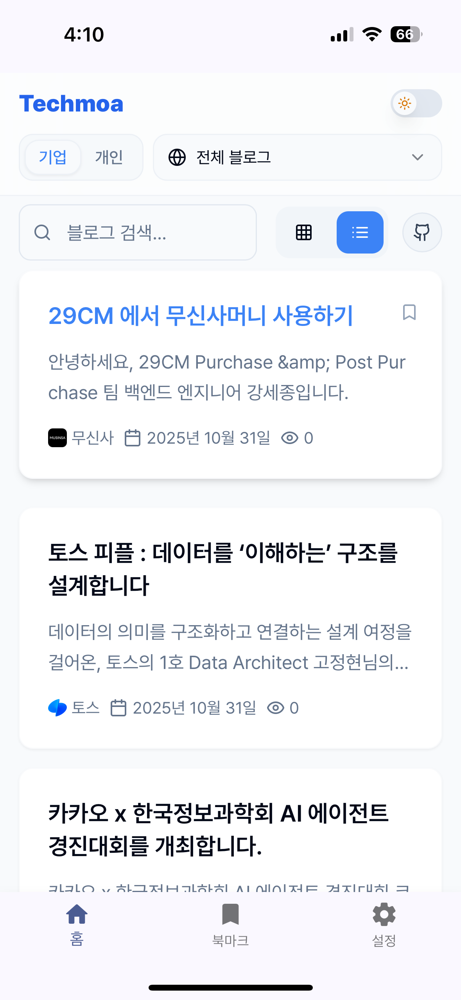
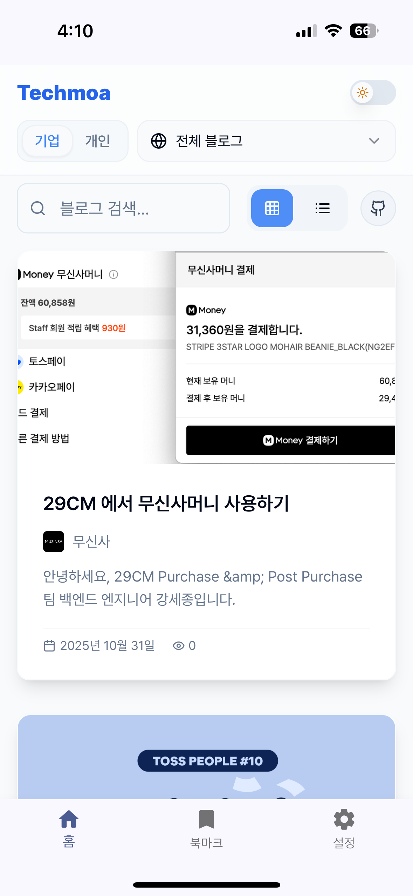
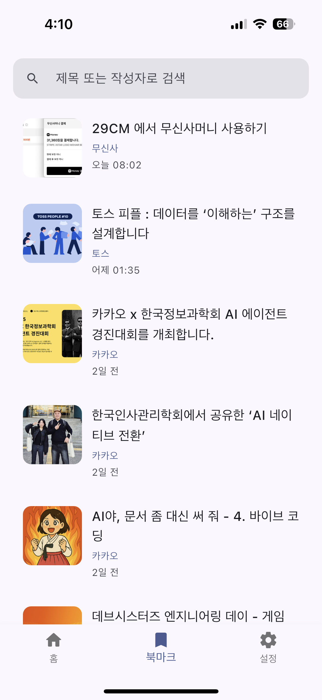

# 📱 Techmoa (Flutter WebView)

국내 주요 기업과 개발자들의 기술 블로그를 모은 [**Techmoa**](https://github.com/hyjoong/techmoa)의 **WebView 앱**입니다.  
웹과 동일한 경험을 제공하면서, **앱에서는 북마크를 기기 로컬에 저장**하도록 최적화했습니다.

---

## 📸 스크린샷

  
  
  

---

## 🧠 주요 특징

- ✅ Flutter WebView 기반으로 **웹 서비스 그대로** 제공
- 🔖 **앱 환경 감지 시** 북마크를 로컬(SharedPreferences)에 저장

---

## 🌐 직접 사용해보세요!

- 🔗 [웹에서 바로 체험하기](https://techmoa.dev)
- 📲 [Google Play에서 설치하기](https://play.google.com/store/apps/details?id=com.techmoa.app)
- 🍎 [App Store에서 설치하기](https://apps.apple.com/us/app/techmoa/id6754512319)
